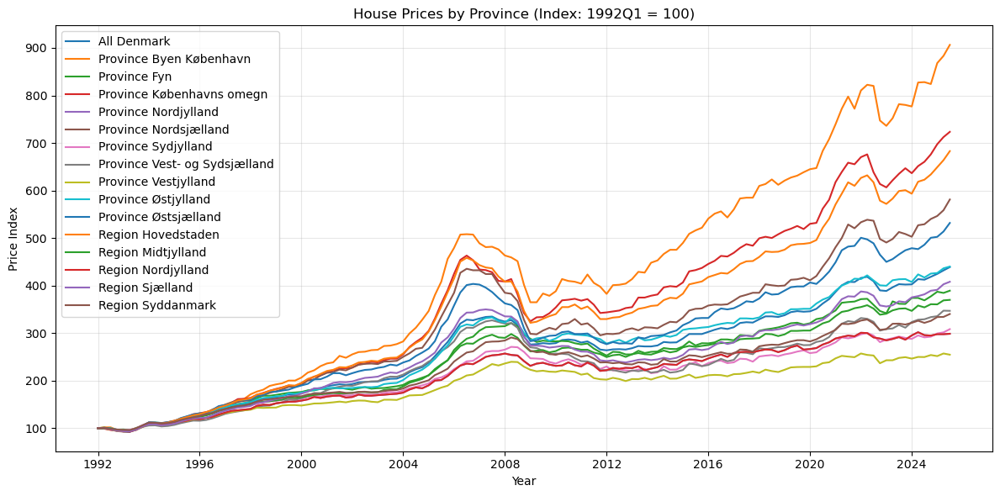
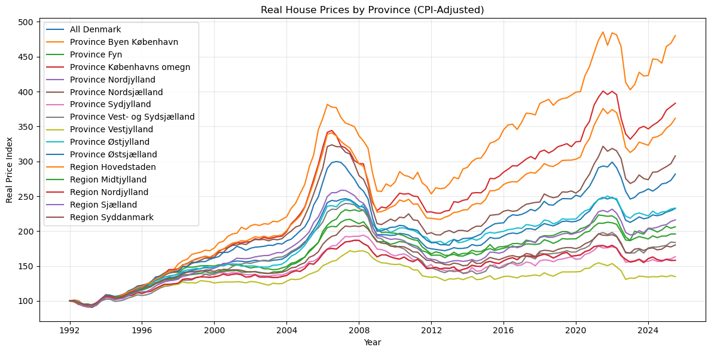
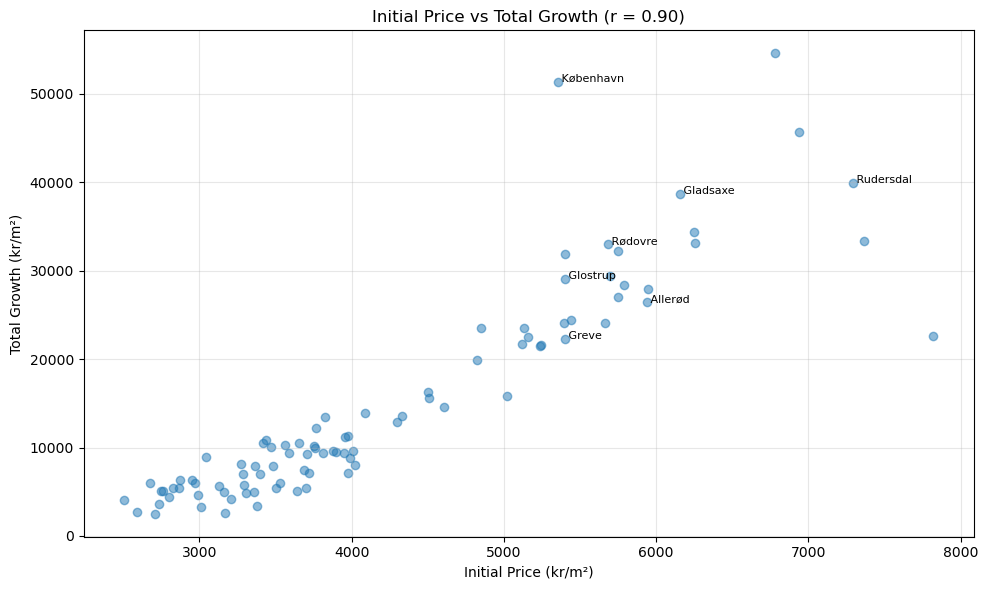
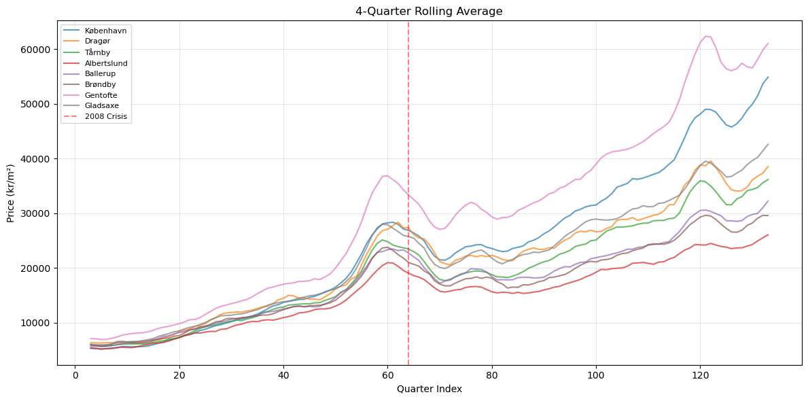

# Danish House Prices: Real vs. Nominal

*BSc Economics, University of Copenhagen — Programming for Economists, Exam Project (2025)*
*Group exam project (Nawid Rasekh, Kasper Vinther, Mads Wittrup) · this problem authored by Nawid Rasekh*

---

## The question

Nominal house price growth overstates real appreciation during high-inflation
periods. How large is the difference once we deflate by CPI, and what does
the real series tell us about regional divergence and the post-2008 recovery
that the nominal series obscures?

---

## Data

Everything is pulled live from Danmarks Statistik — no manual CSVs. Only
the municipality-level spreadsheet lives on disk because it is not available
through the API in the same format.

| Series | Source | Method |
|--------|--------|--------|
| Province-level nominal house price index (EJ56) | Danmarks Statistik API | `dstapi` |
| Consumer price index (PRIS113) | Danmarks Statistik API | `dstapi` (monthly, resampled to quarterly) |
| Municipality-level real prices (BM010) | Pre-downloaded `data/BM010_houses.xlsx` | `pandas.read_excel` |

---

## Method

All nominal prices are deflated to **real 1992Q1 = 100** using CPI. The
deflation is implemented as an index re-base:

$$P^{\text{real}}_{r,t} = \frac{P^{\text{nom}}_{r,t}}{\text{CPI}_t / \text{CPI}_{1992Q1}} \cdot 100$$

where $r$ indexes region (province or municipality) and $t$ indexes quarter.
Monthly CPI is resampled to quarterly means so it lines up with the housing
series.

The module implementing all of this, `house_price_analysis.py`, exposes a
single `DanishHousePrices` class with methods for fetching, deflating,
ranking, and plotting — so the notebook stays clean.

---

## Key findings

### 1. Deflation matters — nominal growth is roughly double the real series



Across all Danish provinces, nominal price growth since 1992 is roughly
double the real growth. Headline stories of "Copenhagen house prices
quadrupled" collapse once you adjust for the general price level.

### 2. Regional divergence is pronounced in real terms



- Copenhagen-area provinces appreciate **far faster** than peripheral
  regions, even after CPI deflation.
- The gap widens systematically post-2000.

### 3. Already-expensive areas appreciated most (polarisation)



The correlation between **initial price level (1992) and total real growth**
is **r ≈ 0.6–0.7** at the municipality level. Expensive municipalities did
not mean-revert; they became relatively *more* expensive. The pattern mirrors what the housing literature documents as polarisation.

### 4. The financial crisis cast a long shadow on peripheral markets



A 4-quarter rolling-average analysis shows that several peripheral
municipalities are **still trading below their pre-2008 real peak**, more
than a decade after the crisis. 

---

## Code architecture

```
danish-house-prices/
├── house_price_analysis.py   # DanishHousePrices class — fetch, deflate, rank, plot
├── notebook.ipynb            # Standalone notebook for this problem, outputs embedded
├── data/
│   └── BM010_houses.xlsx     # Municipality-level panel (not available via API)
├── figures/                  # Exported figures used in this README
├── requirements.txt
└── README.md
```

The `DanishHousePrices` class is designed around a single pipeline:

```python
analyzer = DanishHousePrices()
analyzer.fetch_house_prices()                    # DST EJ56
analyzer.fetch_cpi()                             # DST PRIS113
analyzer.calculate_real_prices()                 # re-base to 1992Q1 = 100
analyzer.rank_provinces()                        # region ranking table
analyzer.load_municipality_data('data/BM010_houses.xlsx')
analyzer.plot_growth_vs_initial()                # scatter + correlation
analyzer.calculate_rolling_average(window=4)
analyzer.analyze_crisis_recovery()               # pre-2008 peak comparison
```

---

## How to run

```bash
pip install -r requirements.txt
jupyter notebook notebook.ipynb
```

An internet connection is required for the DST API calls on EJ56 and PRIS113.
Results may differ slightly from the figures shown here if the source series
has been updated.
