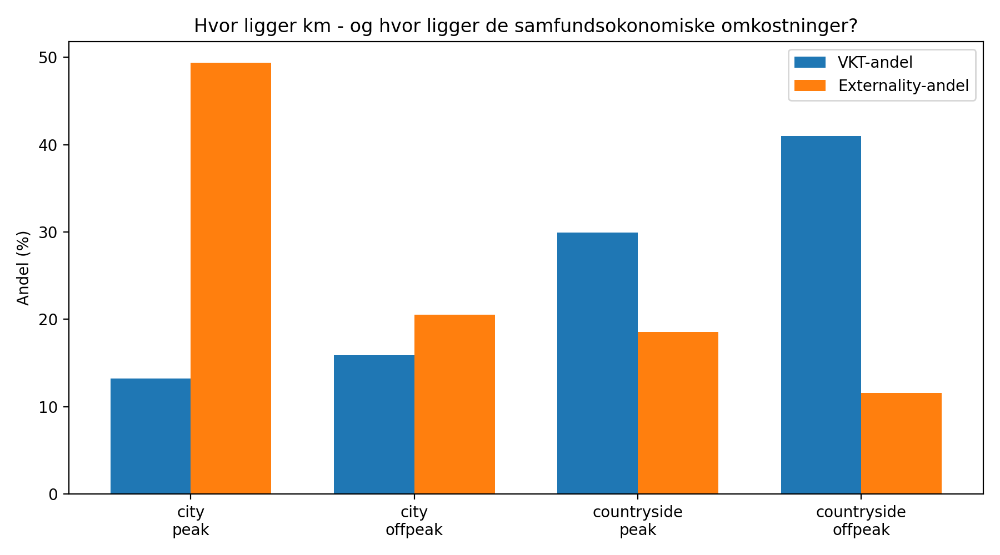
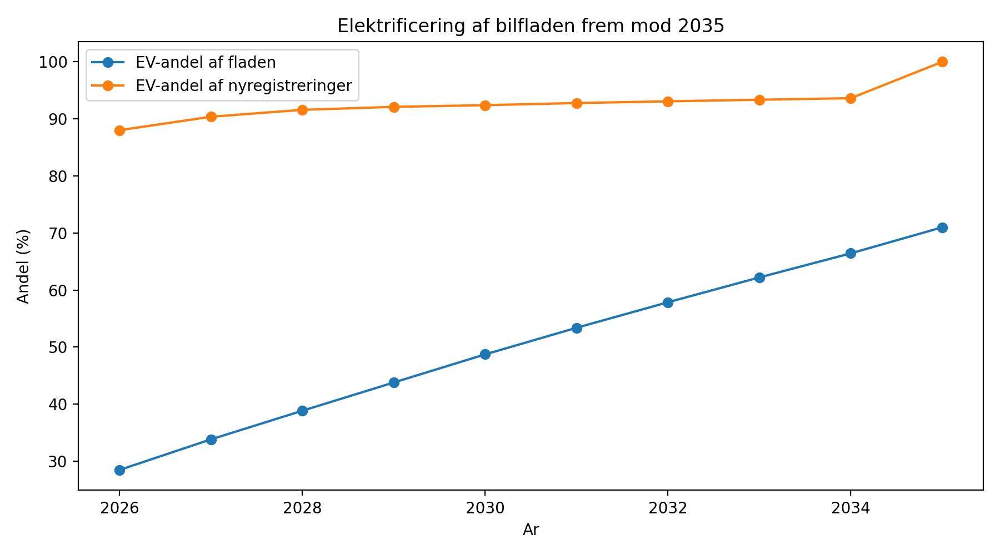
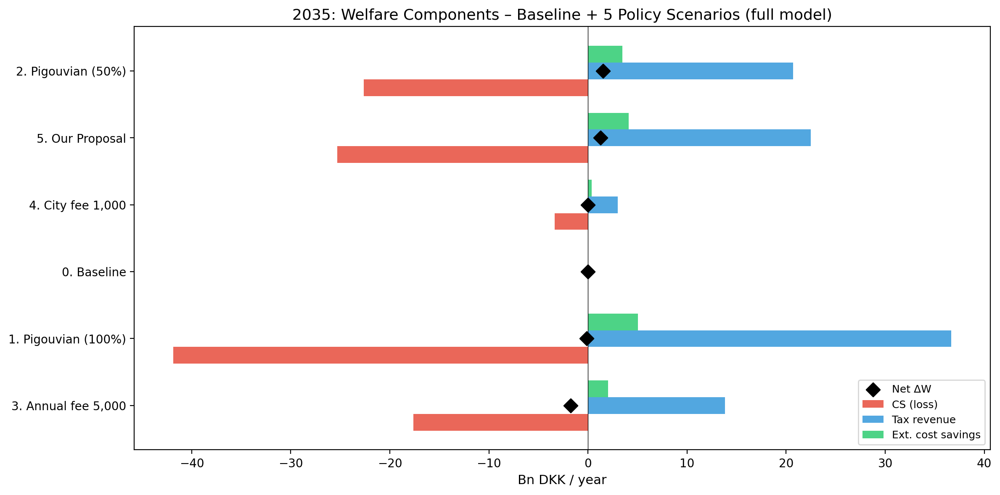
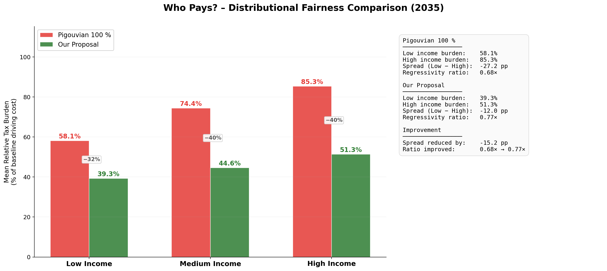
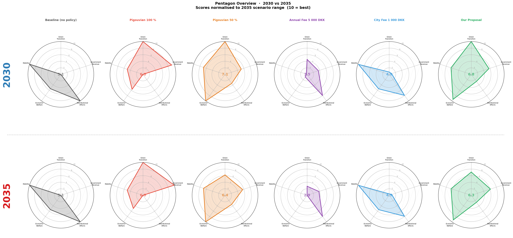

# Road Pricing in Denmark's Electric Vehicle Transition: A Welfare Analysis of VKT Externalities

> Quantitative policy analysis examining how differentiated road pricing can internalise the
> externalities of Vehicle Kilometres Travelled (VKT) as Denmark's car fleet electrifies —
> with a focus on congestion, distributional equity, and net social welfare across the
> 2026–2035 transition period.

---

## Background

Denmark's car fleet is electrifying rapidly: EV share of new registrations reached 88% in 2026
and is projected to hit 100% by 2035. But **electrification does not eliminate road externalities**.
Congestion, accidents, noise, and road wear persist regardless of fuel type. As fuel-tax revenue
disappears, governments face a dual challenge: replacing a major revenue stream while pricing
the remaining externalities efficiently.

This project models five road-pricing policy scenarios against that backdrop, using a
**driver-level welfare framework** calibrated to Danish transport data.

---

## Key Findings

### The Externality Mismatch
City-peak driving accounts for **13% of total VKT but 49% of all road externalities** — driven
almost entirely by congestion costs. This means a flat per-km tax is a blunt instrument;
pricing needs to be segment-differentiated to be both efficient and fair.



### Fleet Transition (2026–2035)
The EV share of the total fleet rises from 28% to 71% over the period. Total VKT grows from
49.2 to 55.5 billion km/year, which means the externality burden *increases* even as tailpipe
CO₂ falls from 4.7 to 2.2 million tonnes annually.



### Scenario Comparison (2035)

| Policy Scenario | Revenue (bn DKK) | Net Welfare (bn DKK) | VKT Reduction | CO₂ Avoided (kt) |
|---|---|---|---|---|
| **Our Proposal** *(50% Pigouvian + 1 000 DKK city fee)* | **22.5** | **+1.26** | **12.8%** | **275** |
| Pigouvian (50%) | 20.7 | +1.50 | 11.2% | 242 |
| Pigouvian (100%) | 36.7 | −0.14 | 17.9% | 389 |
| Annual fee 5 000 DKK | 13.8 | −1.76 | 7.8% | 107 |
| City fee 1 000 DKK | 3.0 | +0.003 | 0.8% | 17 |

**Key insight:** Full Pigouvian taxation maximises environmental impact but destroys consumer
surplus to the point of negative net welfare. The 100% Pigouvian rate overcorrects. Our Proposal
captures 84% of the Pigouvian welfare gain while raising 9% more revenue and causing significantly
less distributional harm.



### Distributional Analysis
The annual fee (5 000 DKK) is the most regressive instrument: it drives 14% of drivers out of car
ownership entirely — disproportionately low-income, rural drivers with no transport alternatives.
Our Proposal (per-km + city fee) causes near-zero dropout while distributing the burden more
evenly across income groups.



### Pentagon Scoring
Each scenario is scored across five policy dimensions (welfare, revenue, green transition,
distributional equity, mobility preservation):



---

## Methodology

### Data
- **Sheet A:** 1 980 individual drivers with annual VKT split across four segments
  (city-peak, city-offpeak, countryside-peak, countryside-offpeak), plus demographics
  (income group, age group, home location, car type)
- **Sheet B:** Danish national fleet projections 2026–2035 (fossil vs. EV stock and new registrations)
- **Sheets C & D:** Internal per-km costs by fuel type; external costs by segment and fuel type

### Elasticity Model
Heterogeneous price elasticities follow Equation (24) of the Technical Appendix:

```
ε_{i,s} = γ₀ + β_income + β_age + β_urban + δ_segment + interaction terms
```

The base elasticity is −0.40 (medium income, middle-aged, rural, off-peak). Low-income drivers
are substantially more elastic (−0.52 in city-peak) because they have fewer alternatives and
tighter budgets. Elasticities are estimated for two specifications: a **full model** (income, age,
home location, and interactions) and a **simplified model** (income and segment only) for
robustness.

### Policy Simulation
Each scenario runs through a four-phase algorithm:
1. **Continuous response:** VKT adjusted via the power-law demand function
2. **Per-km dropout gate:** drivers who would reduce VKT by more than 50% in a segment exit
   that segment (extensive margin)
3. **City-fee gate:** drivers for whom the city fee exceeds 50% of residual city driving cost
   are excluded from city-fee payment
4. **Annual-fee gate:** same 50% threshold applied to total residual driving cost

### Welfare Decomposition
Net welfare = consumer surplus change + government revenue + externality savings (congestion,
pollution). Congestion savings follow a concave functional form with curvature parameter η = 0.95,
reflecting diminishing returns to VKT reduction on congested roads.

All sample-level results are scaled to the national fleet via fuel-type-specific omega weights
derived from the fleet projection data.

---

## Repository Structure

```
.
├── case_analysis.py          # Core model library: data loading, elasticities, policy simulation
├── figurer.py                # Standalone figure generator (run: python figurer.py)
├── analysis.ipynb            # Interactive notebook: exploration, scenario runs, outputs
├── requirements.txt          # Python dependencies
│
├── data/
│   ├── PCC2026.zip           # Original case package (auto-extracted on first run)
│   └── pcc2026/
│       ├── Dataset.xlsx      # Main dataset (Sheets A–D)
│       ├── Technical Appendix.pdf
│       └── The Case.pdf
│
├── outputs/                  # Generated CSV results
│   ├── scenario_results_all.csv        # Full scenario × year × model results
│   ├── scenario_summary.csv            # Condensed scenario summary
│   ├── national_transition_summary.csv # Fleet projections 2026–2035
│   ├── baseline_segment_summary.csv    # VKT & externalities by segment
│   ├── burden_by_income_fuel.csv       # Tax incidence by income and fuel type
│   └── elasticities_by_income.csv      # Estimated elasticities by group
│
└── figures/                  # Generated PNG figures (250 dpi)
    ├── 01–05_*               # Baseline and scenario overview charts
    ├── pentagon_*/           # Pentagon scoring figures (5-dimension radar)
    ├── welfare_*/            # Welfare decomposition and tradeoff charts
    ├── burden_*/             # Distributional and equity analysis
    ├── fleet_*/              # Fleet composition and time-series
    └── pres_*/               # Presentation-ready versions
```

---

## How to Run

**Requirements:** Python 3.10+

```bash
# 1. Install dependencies
pip install -r requirements.txt

# 2. Run a policy scenario (example: Our Proposal in 2035)
python case_analysis.py

# 3. Regenerate all figures
python figurer.py

# 4. Open the interactive notebook
jupyter notebook analysis.ipynb
```

The ZIP archive in `data/` is extracted automatically on first run — no manual setup needed.

---

## Tools & Methods

- **Python** (pandas, NumPy, matplotlib) — data processing, model simulation, visualisation
- **Welfare economics framework** — consumer surplus integral, Pigouvian tax theory, deadweight loss
- **Heterogeneous agent modelling** — driver-level elasticity estimation with demographic interactions
- **Scenario analysis** — 8 policy scenarios × 2 elasticity models × 3 time horizons = 48 runs
- **Distributional analysis** — tax incidence decomposed by income group and fuel type
- **AI-assisted development** — Claude (Anthropic) used throughout for model specification review,
  economic interpretation, and code quality; all analytical judgements and results verified independently

---

## Author

**Nawid Rasekh** — BSc Economics, University of Copenhagen
Group project, PCC 2026 case competition
