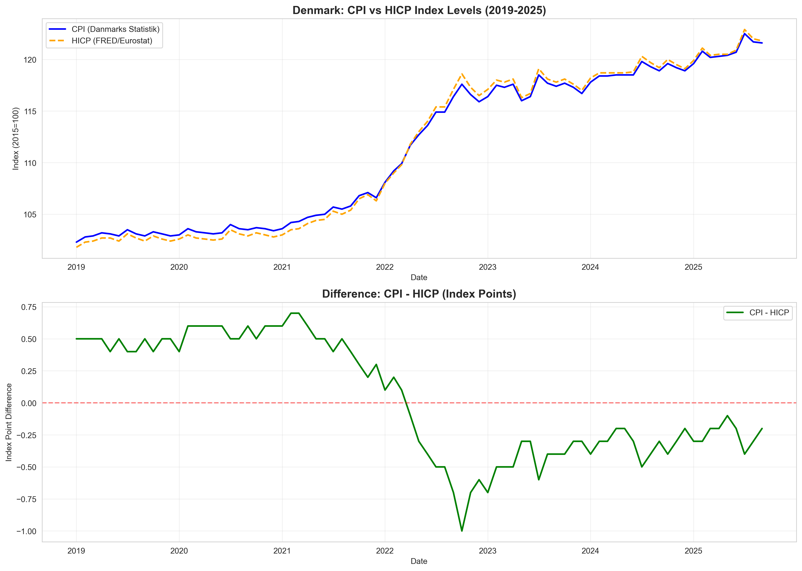
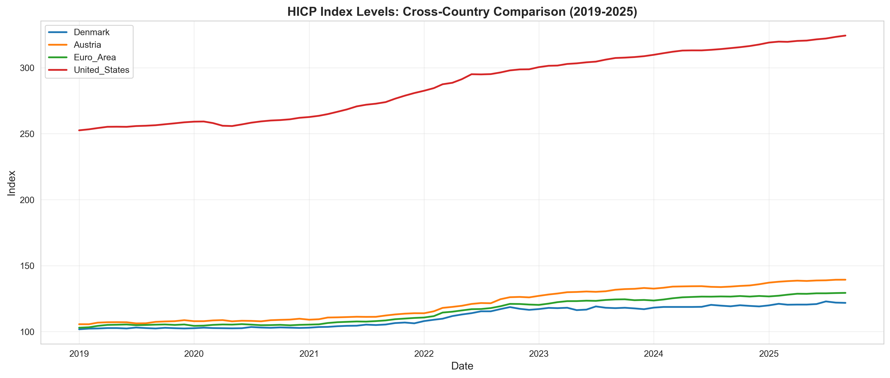
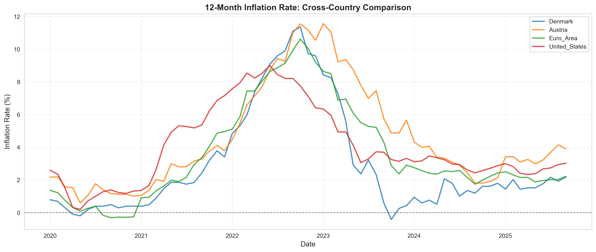

# CPI vs. HICP: International Inflation Comparison

*BSc Economics, University of Copenhagen — Programming for Economists, Data Project (2025)*
*Group: Nawid Rasekh, Kasper Vinther, Mads Wittrup · this section (Section 2) authored by Nawid Rasekh*

---

## The question

Danish headline inflation is routinely reported in two different series: the
national **CPI** (Consumer Price Index, from Danmarks Statistik) and the
harmonised **HICP** (Harmonised Index of Consumer Prices, compiled by Eurostat
for cross-country comparability). If you want to benchmark Denmark against
other European economies, which one should you use — and can the two even be
compared directly?

This project does two things:

1. **Tests the CPI–HICP equivalence** for Denmark using live API data.
2. **Benchmarks Danish inflation** against Austria, the Euro Area, and the
   United States over the 2019–2025 window that spans the post-COVID inflation
   spike.

---

## Data

Everything is pulled live — no manual downloads, no stale CSVs in the repo:

| Series | Source | API |
|--------|--------|-----|
| Danish CPI (PRIS113) | Danmarks Statistik | `dstapi` |
| HICP — Denmark, Austria, Euro Area | Eurostat (via FRED) | `pandas_datareader` |
| US CPI (CPIAUCSL) | FRED | `pandas_datareader` |

All four series are normalised to the same base period so they can be plotted
on one axis, and 12-month inflation rates are computed as
$\pi_t = 100 \cdot (P_t / P_{t-12} - 1)$.

---

## Key findings

### CPI ≈ HICP — for practical purposes

| Metric | Value |
|--------|-------|
| Correlation between Danish CPI and HICP (monthly, 2019–2025) | **0.9994** |
| Mean absolute difference in index level | **0.42 index points** |
| Maximum deviation | < 1 index point |

The two indices track each other closely enough that using HICP for
cross-country comparisons introduces no meaningful bias against Danish CPI
as the domestic reference.



### Denmark, Austria, Euro Area, United States (2019–2025)



- **All four economies track together closely until mid-2021**, then diverge
  as the inflation spike hits. The United States leads the spike in early
  2021; the Euro Area (including Denmark and Austria) follows with a roughly
  six-month lag.
- At the peak (late 2022), **US 12-month inflation touches ~9%** while the
  Euro Area peaks just above 10%, pulled up by energy pass-through in
  continental Europe.
- Denmark sits **below the Euro Area average** throughout the spike and
  returns to sub-3% inflation faster than both the US and the broader Euro
  Area.



---

## Code architecture

```
inflation-cpi-hicp/
├── inflation_analysis.py     # InflationAnalysis class — API fetch, comparison, plotting
├── notebook.ipynb            # Standalone Section 2 notebook (clean, outputs embedded)
├── figures/                  # Saved figures used in this README
├── requirements.txt
└── README.md
```

The `InflationAnalysis` class encapsulates the entire pipeline:

```python
analysis = InflationAnalysis(start_date='2019-01-01')
analysis.get_danish_cpi()         # DST PRIS113
analysis.get_hicp_data()          # FRED — DK, AT, EA, US
analysis.compare_cpi_hicp()       # alignment + difference metrics
analysis.analyze_comparability()  # correlation, mean absolute deviation
analysis.compute_inflation()      # 12-month rates, per country
analysis.plot_cpi_hicp_comparison()
analysis.plot_hicp_levels()
analysis.plot_inflation_rates()
```

Separating the data pipeline (`.py` module) from the presentation
(`.ipynb` notebook) means the analysis can be re-run against fresher data
without touching the notebook, and the class can be reused in other projects.

---

## How to run

```bash
pip install -r requirements.txt
jupyter notebook notebook.ipynb
```

An internet connection is required for the DST and FRED API calls. Results
may differ slightly from the figures in this README as new monthly data
points are released.

---

## Methods

- API-based data ingestion (Danmarks Statistik + FRED)
- Index alignment across different base periods
- Correlation and mean absolute deviation for comparability testing
- 12-month log-difference inflation rates
- Cross-country panel visualisation
