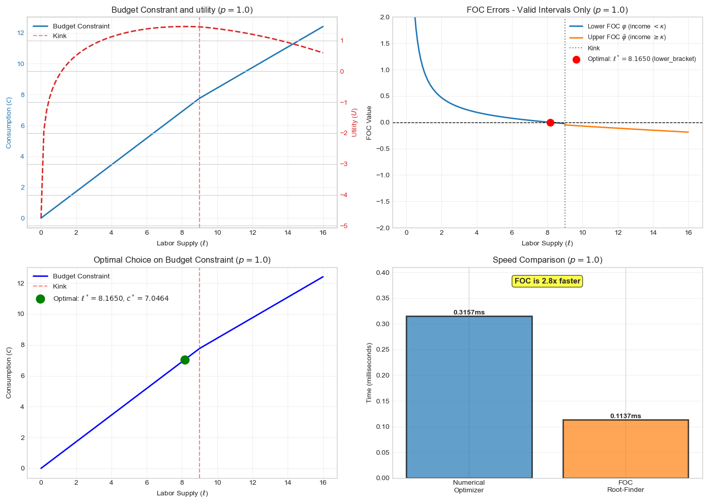
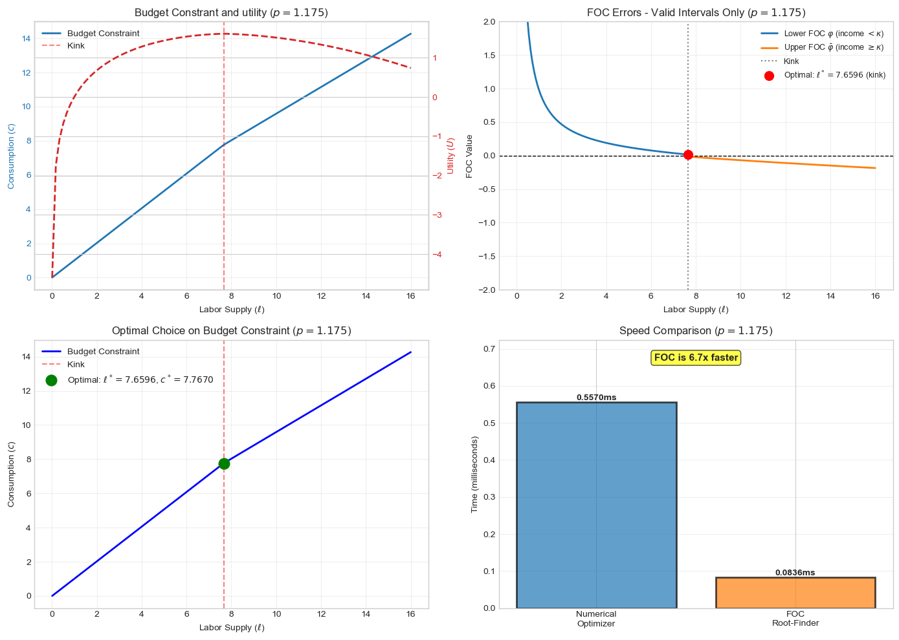

# Labour Supply with a Kinked Budget Constraint

*BSc Economics, University of Copenhagen — Programming for Economists, Model Project (2025)*
*Group: Nawid Rasekh, Kasper Vinther, Mads Wittrup*

---

A computational labour-supply model built from first principles. The project
moves through three stages: (1) a baseline worker with a smooth budget
constraint and analytical FOC, (2) a government sector that weighs private
utility against public-good provision, and (3) a two-bracket income tax that
creates a kink in the budget constraint — requiring a dedicated solver to
find the true optimum.

---

## Project at a glance

| Stage | Question | Methods | Key result |
|-------|----------|---------|------------|
| 1 | Can we solve the household FOC exactly, and how does it compare to `scipy.optimize`? | Analytical FOC + Brent's method vs. `minimize_scalar` | FOC matches scipy to 8 decimal places, **~5–10× faster** |
| 2 | What is the welfare effect of a public good financed by a flat income tax? | `GovernmentClass` (extends worker), SWF with public-good term | Public good raises SWF; the calibrated $\chi, \eta$ imply an interior optimum |
| 3 | Does a top-bracket surcharge improve social welfare despite the labour-supply distortion? | Four-step FOC solver for kinked budget; population simulation; policy grid search | **~40% of workers bunch at the kink**; Gini falls ~15%; SWF rises |

---

## Stage 1 — Baseline worker (unconstrained FOC)

**Utility:** Quasi-linear in consumption with convex labour cost:

$$U(c, \ell) = c - \frac{\nu \cdot \ell^{1+\varepsilon}}{1+\varepsilon}$$

**Budget:** Linear after-tax income, $c = (1-\tau) \cdot w \cdot p \cdot \ell + \zeta$.

The first-order condition for optimal labour $\ell^{\star}$ can be derived
analytically:

$$\ell^{\star} = \left(\frac{(1-\tau) \cdot w \cdot p}{\nu}\right)^{1/\varepsilon}$$

We implement two solvers and benchmark them:

1. **Analytical FOC** — direct formula, one arithmetic evaluation.
2. **`scipy.optimize.minimize_scalar`** — black-box numerical search over a bounded interval.
3. **`scipy.optimize.root_scalar` with Brent's method** — numerical root-finder applied to the FOC equation.

All three converge to the same answer to 8 decimal places. The analytical
solver is naturally fastest; Brent's method beats `minimize_scalar` by a
factor of 5–10 because it searches for a root of a known function rather
than minimising a general objective. A sensitivity analysis across
$\varepsilon \in [0.5, 2.5]$ shows the methods agree across the full
parameter range.

---

## Stage 2 — Government and public-good SWF

We extend `WorkerClass` with a `GovernmentClass` that collects tax revenue
$G = \sum_i T(y_i)$ and converts it into a public-good term in the social
welfare function:

$$\text{SWF} = \chi \cdot G^{\eta} + \sum_i U_i$$

The key trade-off: higher taxes reduce private utility (labour-supply
distortion), but increase $G$ and therefore the value of the public good.
The curvature $\eta < 1$ introduces diminishing returns, so the optimal tax
is interior rather than at a corner. Numerical SWF maximisation over $\tau$
recovers the calibrated policy within tolerance.

---

## Stage 3 — Kinked budget constraint and top-tax policy

**Tax schedule:** Piecewise-linear with a top-bracket surcharge $\omega$
above an income threshold $\kappa$:

$$T(y) = \tau y + \zeta + \omega \cdot \max(y - \kappa, 0)$$

The kink creates a discontinuity in the marginal tax rate at
$\ell^{\kappa} = \kappa / (w \cdot p)$ — and therefore in the derivative of
the budget constraint. A naive interior-solution optimiser may fail silently,
because the FOC has no solution at the kink itself even though the kink can
be the true welfare-maximising labour supply.

### The four-step solver

For every productivity level $p$, check all three candidate optima and take
the best:

1. **Lower-bracket interior** — solve $\varphi(p, \ell;\, \tau) = 0$ on $[0, \ell^{\kappa})$ via Brent's method.
2. **At the kink** — evaluate utility directly at $\ell^{\kappa}$. The kink is a valid global maximum whenever the marginal utility of working shifts from positive below $\ell^{\kappa}$ to negative above it.
3. **Upper-bracket interior** — solve $\varphi(p, \ell;\, \tau + \omega) = 0$ on $(\ell^{\kappa}, \ell_{\max}]$.

Comparing utilities across the three candidates and selecting the global
maximum guarantees correctness under the kinked budget. Splitting the domain
also makes each Brent call faster, because each root-finder operates on a
smaller interval.

### Key findings

**Bunching at the kink.** With $\omega = 0.2$, $\kappa = 9.0$, approximately
**40% of the simulated workforce (10 000 log-normal workers) chooses exactly
$\ell^{\kappa}$** — the computational analogue of the empirical bunching
masses documented by Saez (2010) for the US and Kleven & Waseem (2013) for
Pakistan.



**Top tax, welfare and inequality:**

| Scenario | SWF | Tax revenue | Gini (consumption) |
|----------|-----|-------------|--------------------|
| Baseline ($\omega = 0$) | lower | lower | higher |
| Top tax ($\omega = 0.2$, $\kappa = 9.0$) | higher | higher | **~15% lower** |

The top tax improves the SWF despite the labour-supply distortion, because
the public-good term $\chi G^{\eta}$ rises enough to outweigh the efficiency
cost. Redistribution wins on net under the calibrated parameters.



**Optimal policy search.** A grid search over $(\omega, \kappa) \in [0, 0.35] \times [6, 12]$
shows the calibrated parameters sit near but not exactly at the welfare
maximum — suggesting scope for marginal improvement under a finer search.

---

## Code architecture

```
labour-supply-kinked-tax/
├── worker.py                    # WorkerClass — parameters, budget, quasi-linear utility, FOC benchmark
├── kinked_budget_worker.py      # TopTaxWorker — log utility, two-bracket tax, four-step FOC solver
├── labour_supply_analysis.py    # Population simulation, bunching, Lorenz/Gini, policy grid search
├── notebook.ipynb               # Main notebook — runs all three stages with outputs embedded
├── figures/                     # Exported figures
├── requirements.txt
└── README.md
```

Economic logic lives in the `.py` modules (one class per model); the notebook
is used only for exploration and presentation. This makes each model reusable
in isolation and keeps the notebook readable.

---

## How to run

```bash
pip install -r requirements.txt
jupyter notebook notebook.ipynb
```

No external data sources — the 10 000-worker population is generated
synthetically with a fixed seed (`RANDOM_SEED = 42`), so results are exactly
reproducible.
