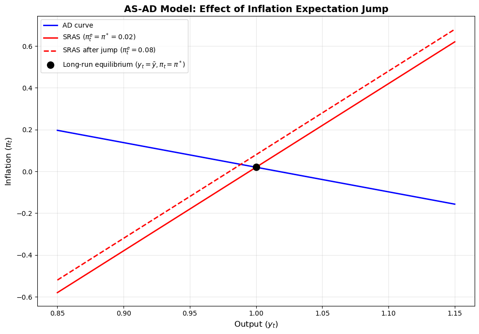
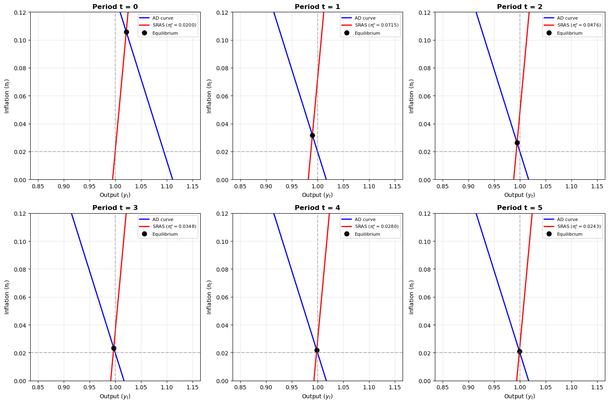
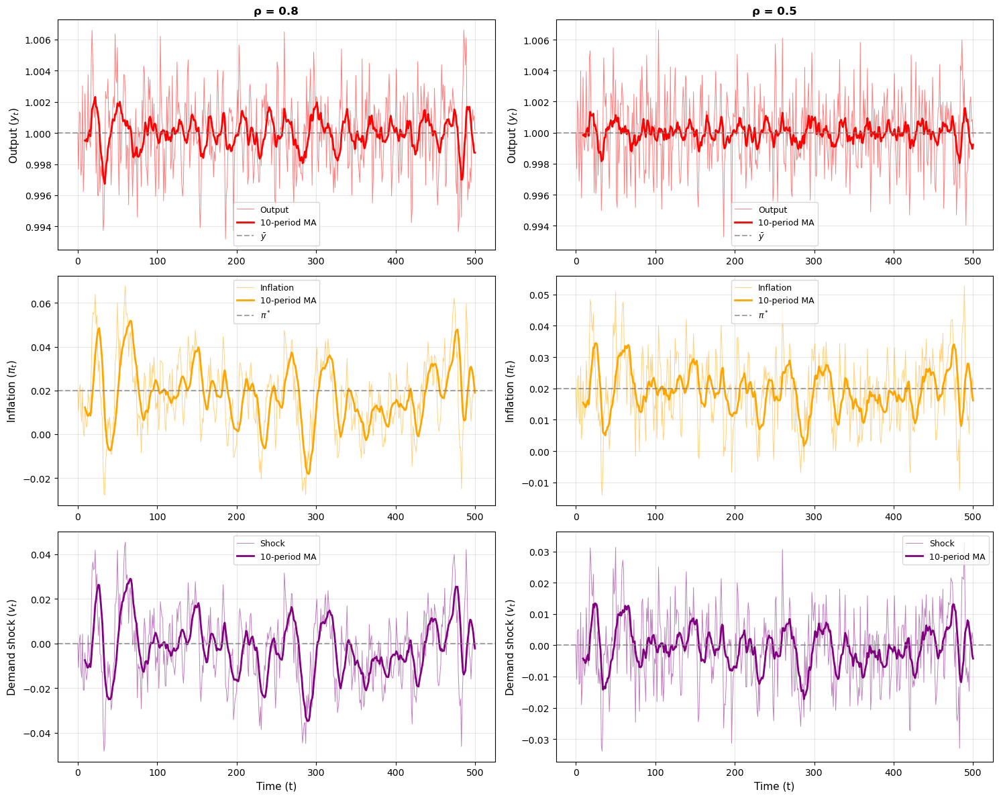

# AS-AD Macroeconomic Model with Adaptive Expectations

*BSc Economics, University of Copenhagen — Programming for Economists, Exam Project (2025)*
*Group: Nawid Rasekh, Kasper Vinther, Mads Wittrup · primary author: Mads Wittrup*

---

## The question

A discrete-time AS-AD model lets us trace exactly how a one-time demand
shock propagates through output and inflation when expectations adjust
adaptively. How long does the economy take to return to steady state, and
how does that horizon depend on (1) shock persistence and (2) the speed
with which agents update their inflation expectations?

---

## Model

Standard AS-AD in $(y_t, \pi_t)$-space, with the AD curve derived from an
IS-MP framework (Taylor rule + IS equation):

**AD curve:**
$$\pi_t = \pi^{*} - \frac{1}{\alpha}\left[(y_t - \bar{y}) - z_t\right]$$

**SRAS curve:**
$$\pi_t = \pi^{e}_t + \gamma(y_t - \bar{y})$$

**Adaptive expectations:**
$$\pi^{e}_t = \phi \cdot \pi_{t-1} + (1 - \phi) \cdot \pi^{e}_{t-1}$$

**Demand shock process:** $z_t = \rho \cdot z_{t-1} + v_t$, with $v_t \sim \mathcal{N}(0, \sigma^2)$.

In each period the equilibrium $(y_t, \pi_t)$ is solved analytically by
substituting SRAS into AD, treating $\pi^e_t$ and $z_t$ as known from the
previous period. This avoids any numerical root-finding inside the time loop
and makes long simulations cheap.

---

## Key results

### One-time positive demand shock

A one-time impulse $v_1 > 0$ raises both output and inflation on impact.
The SRAS curve then shifts upward in subsequent periods as expected
inflation catches up with realised inflation, producing the classic
overshoot-then-return path.



### Persistence amplifies and prolongs the shock

Increasing the AR(1) persistence parameter $\rho$ does two things at once:
the deviation from $(\bar{y}, \pi^{*})$ is *larger* on impact (because the
shock keeps feeding the system) *and* it lasts longer.



When $\rho \to 1$, the shock effectively becomes permanent and the economy
loses its return path — a stylised version of the central-bank concern that
"transitory" shocks can become structurally embedded if persistence is
underestimated.

### Stochastic simulation under different persistence

Running the model with $T = 100$ periods of stochastic shocks under
$\rho = 0.5$ vs. $\rho = 0.9$ confirms the analytical result: the
unconditional standard deviation of both output and inflation rises sharply
with persistence.



### Why adaptive expectations matter

Lower $\phi$ (more rigid expectations — less weight on yesterday's
inflation, more on yesterday's expectation) slows convergence back to
target. The mechanism is the same one central banks worry about: once
inflation expectations de-anchor, returning the economy to target inflation
is more costly because the SRAS curve adjusts more slowly to actual
inflation.

---

## Code architecture

```
as-ad-macro-model/
├── as_ad_model.py          # ASADModelClass — analytical solution, simulation, moments
├── notebook.ipynb          # Standalone notebook for this problem, outputs embedded
├── figures/                # Exported figures
└── README.md
```

The class has a small, clean interface:

```python
model = ASADModelClass()
model.simulate(T=100, seed=42)
df = model.results        # pandas DataFrame: y_t, pi_t, pi_e_t, z_t
stats = model.moments()   # std, autocorrelation, mean deviation
```

---

## How to run

```bash
pip install numpy matplotlib pandas
jupyter notebook notebook.ipynb
```

No external data — all simulations are seeded for reproducibility.
