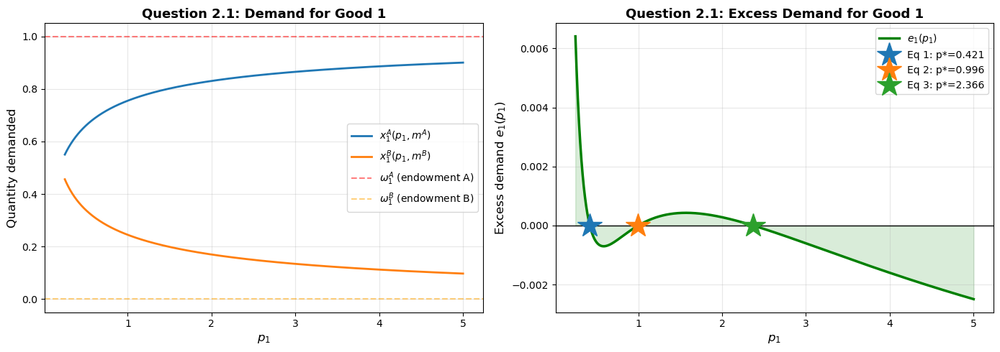
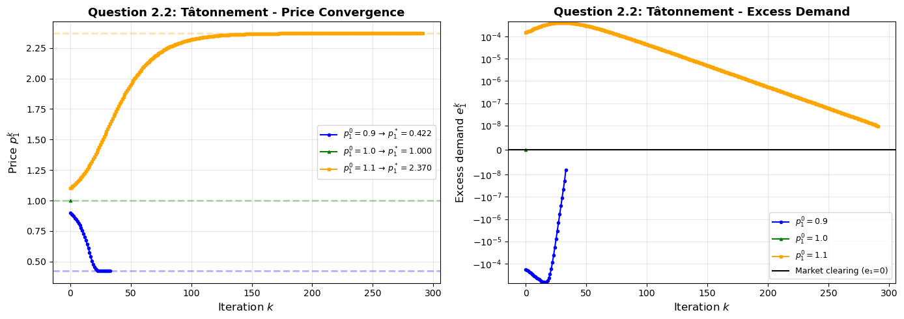
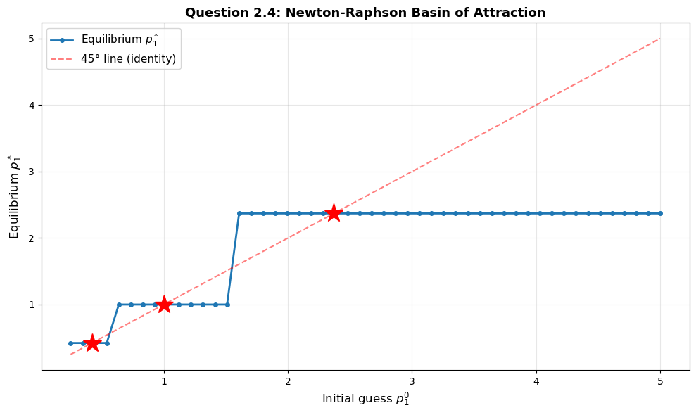
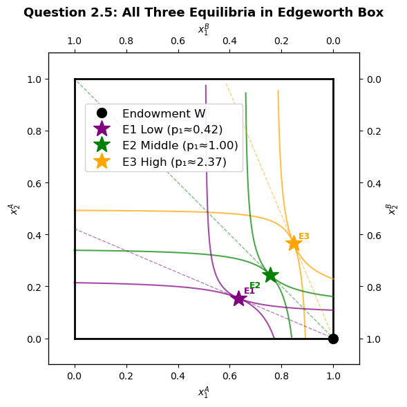

# Walrasian Exchange Economy with CES Preferences

*BSc Economics, University of Copenhagen — Programming for Economists, Exam Project (2025)*
*Group: Nawid Rasekh, Kasper Vinther, Mads Wittrup · primary author: Kasper Vinther*

---

## The question

In a pure exchange economy with two agents, two goods, and CES preferences,
we know — analytically — that gross complements ($\rho < 0$) can produce
*multiple* Walrasian equilibria. But which equilibrium does a given price
adjustment process actually find, and how does the answer depend on the
algorithm?

This problem implements both **tâtonnement** and **dampened Newton-Raphson**
price adjustment from scratch, locates the equilibria, and maps the basins
of attraction.

---

## Setup

Two agents (A and B), two goods, CES utility:

$$u_i(x_1, x_2) = \left(\alpha_i x_1^{\rho} + \beta_i x_2^{\rho}\right)^{1/\rho}, \quad \rho < 0$$

Good 2 is the numeraire ($p_2 = 1$); a Walrasian equilibrium is any price
$p_1$ that clears the market for good 1, i.e. excess demand
$e_1(p_1) = x_1^A(p_1) + x_1^B(p_1) - \omega_1 = 0$.

With the calibrated $\rho = -2$ and the chosen endowments, the excess
demand function crosses zero **three times** — three Walrasian equilibria
co-exist.



---

## Algorithms

| Method | Update rule | Convergence |
|--------|-------------|-------------|
| Tâtonnement | $p^{k+1} = p^k + \nu \cdot e_1(p^k)$ | ~200–500 iterations; can miss the unstable equilibrium |
| Dampened Newton-Raphson | $p^{k+1} = p^k - \lambda \cdot e_1(p^k) / e_1'(p^k)$ | < 20 iterations; finds all three equilibria |

The tâtonnement step size $\nu$ is small enough to guarantee monotone
convergence under gross substitutes, but with gross complements the
convergence is slow and the algorithm fails on the *unstable* middle
equilibrium — small perturbations push the price trajectory away from it.

Newton-Raphson is dampened by a factor $\lambda < 1$ to prevent overshoot
across the steeply sloped excess-demand function. The numerical derivative
is computed by central finite differences.



---

## Basin of attraction

Running each algorithm from 500 initial price guesses across the relevant
range and recording which equilibrium it converges to gives the basin
structure:



- **Tâtonnement** finds only the two outer (stable) equilibria. The middle
  equilibrium has measure-zero basin under continuous tâtonnement.
- **Dampened Newton-Raphson** converges to all three equilibria depending
  on the starting price, including the unstable middle one — because
  Newton steps are not monotone in $e_1$ and can land on the unstable
  fixed point.

This is the textbook stability story made concrete: a stable equilibrium
is one where the dynamic process pushes you back after a small perturbation,
and tâtonnement is precisely such a process. Newton-Raphson, in contrast,
is a root-finder, not a market-adjustment dynamic — it has no economic
interpretation as a "stability test", which is why it can land on
equilibria the market itself would never select.

---

## The Edgeworth box

All three equilibria are visualised in the Edgeworth box together with the
relevant indifference curves and budget lines, making it visually clear why
each price ratio clears the market:



---

## Code architecture

```
exchange-economy-ces/
├── exchange_economy_model.py   # ExchangeEconomyModelClass — utility, demand, excess demand, plotting
├── notebook.ipynb              # Standalone notebook for this problem, outputs embedded
├── figures/                    # Exported figures
└── README.md
```

The model class exposes a clean separation between the economic primitives
(utilities, demands) and the algorithmic primitives (`tatonnement`,
`newton_raphson_dampened`, `find_unique_equilibria`), so the same model
can be solved with either method without rewriting the economy.

---

## How to run

This project depends on the requirements installed at the
[programming-for-economists/](../) level. From this folder:

```bash
pip install numpy matplotlib scipy
jupyter notebook notebook.ipynb
```

No external data sources — all parameters and endowments are set in the
constructor.
